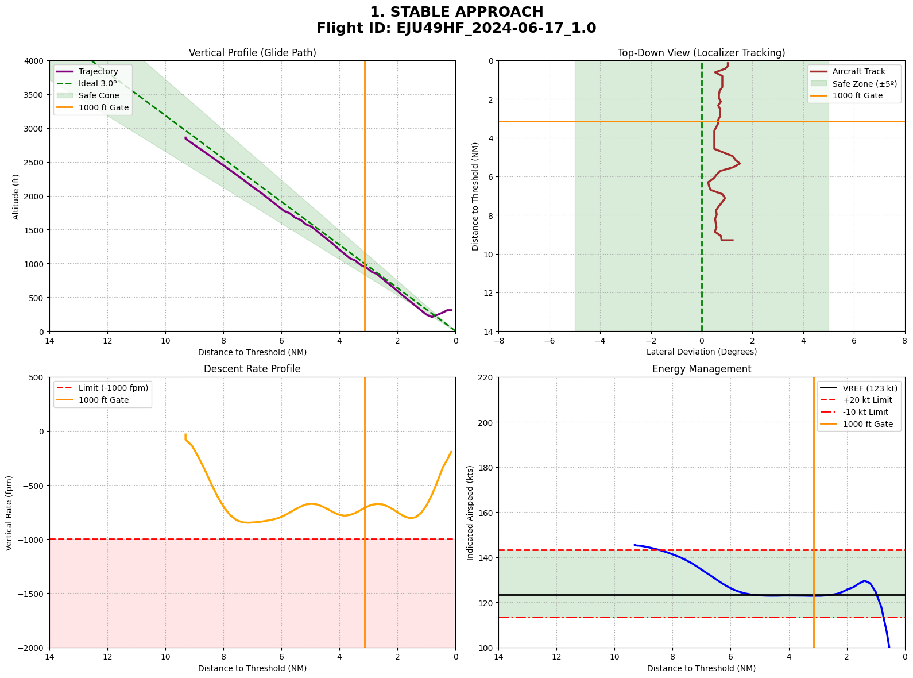
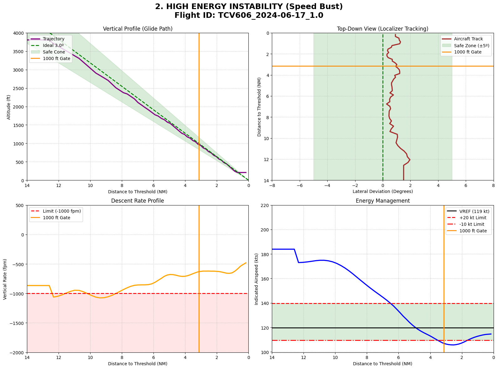

# LPPT-stabilized-approach
A data-driven Python pipeline to evaluate aircraft approach stability and energy management using multi-sensor surveillance data.

## Project Overview
This repository serves as a showcase for a data-driven pipeline designed to evaluate aircraft approach stability at Humberto Delgado Airport (LPPT). By processing raw, multi-sensor surveillance telemetry (Radar, ADS-B, MLAT) from NAV Portugal, the project reconstructs precise flight kinematics to assess energy management and spatial deviation against industry-standard safety envelopes at the 1000 ft AGL gate.

The traditional binary (pass/fail) stabilization criteria have been augmented with a novel continuous Gaussian scoring model and a predictive spatial tracking metric at 6 NM, providing a more nuanced framework for operational safety auditing in high-density terminal areas.

## Repository Structure
To protect proprietary data and maintain confidentiality, this repository is a condensed showcase of the project:
* 📄 **`Flight_Stability_Report.pdf`**: The complete engineering report containing the full methodology, mathematical framework, and detailed case studies.
* 💻 **`core_analysis.py`**: An extract of the core Python algorithms developed for this study, including the Savitzky-Golay kinematic filtering, dynamic $V_{REF}$ estimation, and the continuous scoring functions.

## Visualizing Flight Dynamics

### 1. Nominal Operation (Stable Profile)
*This 4-axis dashboard illustrates a textbook convergence into all safety envelopes. Energy management is optimal, crossing the 1000 ft gate perfectly matched to the dynamically calculated reference speed.*

### 2. High-Energy Exceedance (Unstable Profile)
*A deceptive operational risk: an approach that is spatially flawless on the localizer and glide path, but fails to shed kinetic energy in time, sharply busting the upper tolerance limit of VREF + 20 knots.*

## Core Findings at LPPT
* **Global Unstabilized Rate:** Real-world data revealed an unstabilized approach rate of **10.76%**, driven primarily by glide path capture issues and excess kinetic energy resulting from tight Air Traffic Control (ATC) sequencing.
* **The Widebody Energy Challenge:** Heavy jets recorded a high instability rate of **24.32%**, struggling to simultaneously decelerate and descend due to high inertia and low aerodynamic drag when subjected to high-speed approach clearances.
* **Predictive Nowcasting:** Spatial deviation mapping at the 6 NM window proved to be a highly reliable early indicator of eventual instability at the 1000 ft gate.

---

## About the Author
**Ignacio Bernal** 
*Aerospace Engineering Student | ETSI Sevilla | Instituto Superior Técnico Lisboa*

I am an aerospace engineering student with a strong focus on Air Transport and Airport Infrastructure. I leverage technical tools like Python and data engineering to solve complex operational challenges in the aviation sector. 

📫 **Contact** 
* [LinkedIn](https://www.linkedin.com/in/ignaciobernalmedina/)
* [Portfolio](https://ignaciobernal.github.io/web)
